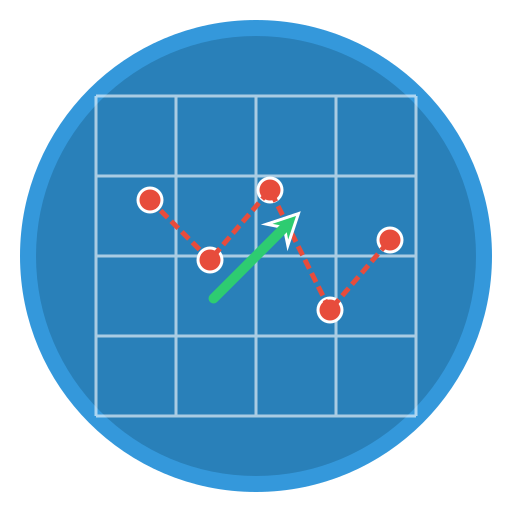

# Welcome to GeoTrack Visualizer

## Overview
GeoTrack Visualizer is a powerful desktop application for visualizing geospatial tracking data. It allows you to load and explore TIFF maps with GeoJSON point overlays, providing interactive tools for data analysis.

## Key Features

### 🗺️ Map Visualization
- **TIFF Maps**: Display georeferenced TIFF files in grayscale or color
- **GeoJSON Overlays**: Plot point data with interactive features
- **Multiple Styles**: Choose between Default, Terrain, and Satellite views

### 🧭 Directional Indicators
- **Bearing Arrows**: Automatically displays direction arrows based on "TN Bearing" attribute
- **Color Coding**: Red points with blue direction indicators for clear visualization

### 🔍 Interactive Data Exploration
- **Click Points**: Click on any point to view all its attributes in a popup
- **Hover Information**: Hover over points to see key attributes in a tooltip
- **Data Table**: View and sort all point data in the integrated table

### 🛠️ Toolbar Functions
-  **Pan**: Click and drag to move around the map
-  **Zoom In**: Increase detail level for closer inspection
-  **Zoom Out**: Decrease detail level to see more area
-  **Reset View**: Return to the original map extent
-  **Save**: Export the current map view as an image

### 🌓 Display Options
- **Dark/Light Mode**: Toggle between dark and light themes
- **Map Styles**: Change the appearance of the base map

## Getting Started
1. Click the "Start" button below to begin
2. Select "Historical Tracking" on the main screen
3. Choose your TIFF and GeoJSON files when prompted
4. Explore your data using the interactive tools

*GeoTrack Visualizer - Bringing your tracking data to life*
